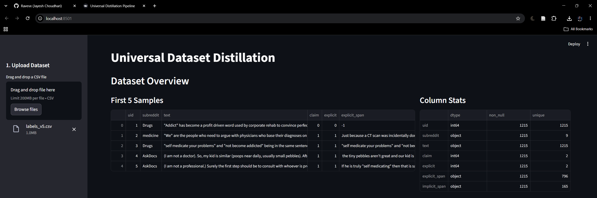
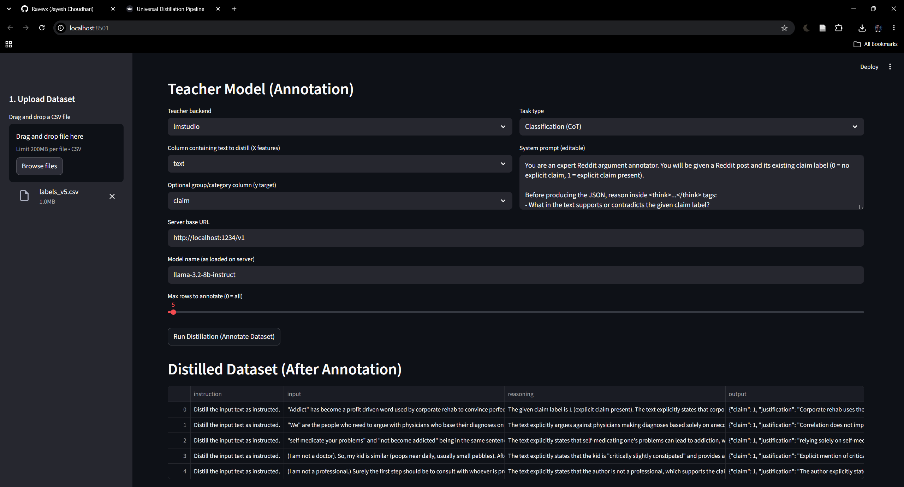
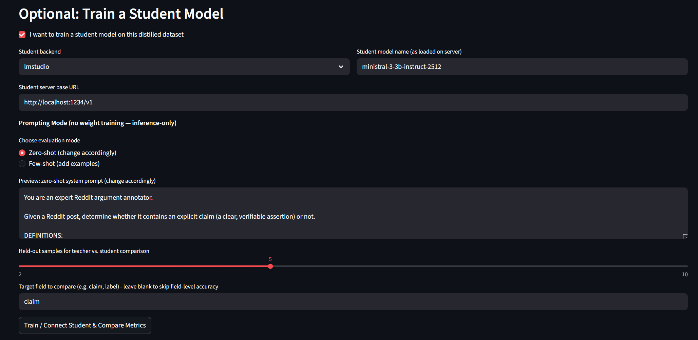
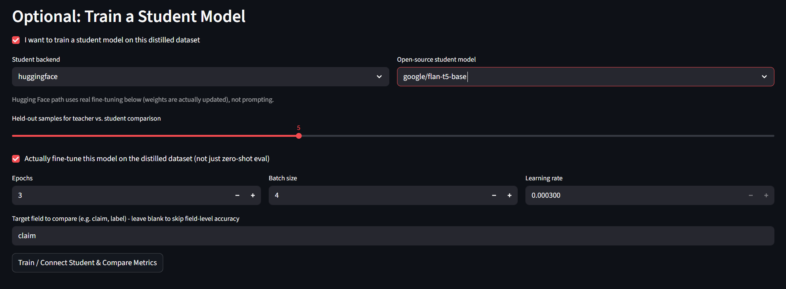
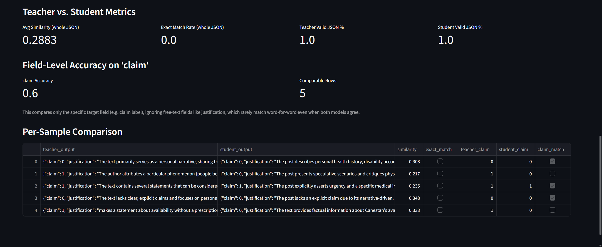

# Universal Dataset Distillation Pipeline

> A no-code Streamlit app for **LLM knowledge distillation** - annotate any dataset with a large "teacher" model, then evaluate or fine-tune smaller "student" models via zero-shot, few-shot, or full weight updates. all from a single UI.

Supports **Hugging Face, Ollama, LM Studio, Groq, and custom APIs** for both the teacher and the student - mix and match freely.

---

## Table of Contents

- [Features](#features)
- [Screenshots](#screenshots)
- [How It Works](#how-it-works)
- [Installation](#installation)
- [Usage](#usage)
- [Supported Backends](#supported-backends)
- [Supported Student Model Architectures (Fine-Tuning)](#supported-student-model-architectures-fine-tuning)
- [Project Structure](#project-structure)


---
## Features

- **Bring your own dataset** - upload any CSV, pick which column to distill and which column (if any) is your target/group label.
- **Choose your teacher backend** - Groq (cloud), Ollama (local), LM Studio (local), Hugging Face (local), or any custom REST API.
- **Built-in task templates** - Argument Mining, Summarization, Classification, Question Answering, or write your own custom system prompt.
- **Chain-of-thought annotation** - teacher reasoning is captured separately (`<think>...</think>`) from the final structured JSON output.
- **Two ways to test a student model:**
  - **Prompt-based (zero-shot / few-shot)** - no training, just evaluate how well a smaller model performs with the same or example-augmented prompt (Ollama, LM Studio, custom APIs).
  - **Real fine-tuning** - actually update model weights on your distilled dataset using Hugging Face `transformers` (supports both T5-family seq2seq models and causal LMs like Qwen, Mistral, DeepSeek-R1-Distill).
- **Teacher vs. student evaluation** - whole-JSON similarity, exact match rate, valid-JSON rate, and field-level accuracy (e.g. does the student agree with the teacher on the `claim` label specifically).
- **Export everything** - download your distilled dataset as CSV or JSONL at any point.

---
## Screenshots

### 1. Upload & Explore Dataset
Upload any CSV and instantly see a preview and column-level stats (dtype, non-null counts, unique values).



### 2. Configure Teacher & Run Distillation
Pick your teacher backend, task type, the column to distill (X features), an optional group/target column (Y target), server URL / model name, and how many rows to annotate. Once done, download the distilled dataset as CSV or JSONL.



### 3. Student Evaluation - Prompt-Based (Zero-shot / Few-shot)
For Ollama, LM Studio, or custom API students: pick zero-shot (same prompt as teacher, no examples) or few-shot (auto-injects real annotated examples into the prompt), set held-out sample size, and choose which JSON field to score accuracy on.



### 4. Student Training - Hugging Face Fine-Tuning
For Hugging Face students: pick an open-source model, it loads automatically, and you set epochs, batch size, and learning rate. The model is actually fine-tuned (weights updated) on your distilled dataset - works with both T5-family (seq2seq) and causal LMs (Qwen, Mistral, DeepSeek-R1-Distill).



### 5. Teacher vs. Student Evaluation
Compare outputs side-by-side with aggregate metrics (avg similarity, exact match rate, valid JSON %) plus field-level accuracy on your chosen target field (e.g. `claim`).



---

## How It Works

```
Your CSV → Teacher Model (annotates with reasoning + structured JSON) → Distilled Dataset
                                                                               │
┌──────────────────────────────────────────────────────────────────────────────┴───┐
│                                                                                  │
│     Student: Prompt-based eval Student: Hugging Face fine-tuning                 │
│     (Ollama / LM Studio / Custom API) (real weight updates via PyTorch)          │
│Zero-shot or Few-shot, no training T5 seq2seq or causal LM (Qwen/Mistral/DeepSeek)│
│                                                                                  │
└────────────────────────────┬─────────────────────────────────────────────────────┘
                             ▼
                 Teacher vs. Student Metrics
         (similarity, exact match, valid JSON %, field accuracy)
```

---

## Installation

```bash
git clone https://github.com/ravevx/universal-dataset-distillation-pipeline.git
cd universal-distillation-pipeline

conda create -n distill-env python=3.11
conda activate distill-env

pip install -r requirements.txt
```

## Usage

```bash
streamlit run app.py
```

Then in your browser:

1. **Upload a CSV** from the sidebar.
2. **Configure the teacher model** - choose a backend, task type, and which column holds your text (X) and optional label/group column (Y).
3. Click **Run Distillation** to annotate your dataset with reasoning chains + structured JSON.
4. Download the distilled dataset (CSV/JSONL) if you just want the silver dataset.
5. Optionally, check **"I want to train a student model"** and:
   - Pick a backend - **Ollama / LM Studio / Custom** for zero-shot or few-shot prompt evaluation (no training), or **Hugging Face** for real fine-tuning.
   - Set your evaluation/training parameters.
   - Click **Train / Connect Student & Compare Metrics** to see teacher-vs-student performance.

---

## Supported Backends

| Backend | Teacher | Student | Notes |
|---|---|---|---|
| Groq | ✅ | ❌ | Cloud API, needs API key |
| Ollama | ✅ | ✅ (prompt-only) | Local server, e.g. `http://localhost:11434/v1` |
| LM Studio | ✅ | ✅ (prompt-only) | Local server, e.g. `http://localhost:1234/v1` |
| Hugging Face | ✅ | ✅ (fine-tunable) | Runs locally via `transformers`; supports T5-family and causal LMs |
| Custom API | ✅ | ✅ (prompt-only) | Any REST endpoint accepting a prompt and returning text |

---

## Supported Student Model Architectures (Fine-Tuning)

The fine-tuning pipeline (`student_generic.py`) auto-detects the model architecture and routes accordingly:

| Architecture | Example Models | Tokenizer/Model Classes |
|---|---|---|
| Seq2Seq (encoder-decoder) | `google/flan-t5-base`, `google/flan-t5-large` | `T5Tokenizer`, `T5ForConditionalGeneration` |
| Causal (decoder-only) | `Qwen/Qwen2.5-1.5B-Instruct`, `deepseek-ai/DeepSeek-R1-Distill-Qwen-1.5B`, Mistral-family | `AutoTokenizer`, `AutoModelForCausalLM` |

Causal LM fine-tuning masks prompt tokens so loss is only computed on the target/completion, following standard instruction-tuning practice.

---

## Project Structure
```
├── app.py # Streamlit UI - dataset upload, teacher config, student config, metrics
├── model_connectors.py # Unified connector interface for Groq / Ollama / LM Studio / HF / custom APIs
├── silver_generator.py # Task prompts + annotation loop (teacher distillation logic)
├── metrics.py # Teacher vs. student comparison metrics (similarity, exact match, field accuracy)
├── student_generic.py # Hugging Face fine-tuning (T5 seq2seq + causal LM support)
├── assets/ # Screenshots used in this README
└── requirements.txt
```
---

Issues and pull requests are welcome. If you add support for a new backend or model architecture, please update the tables above.
